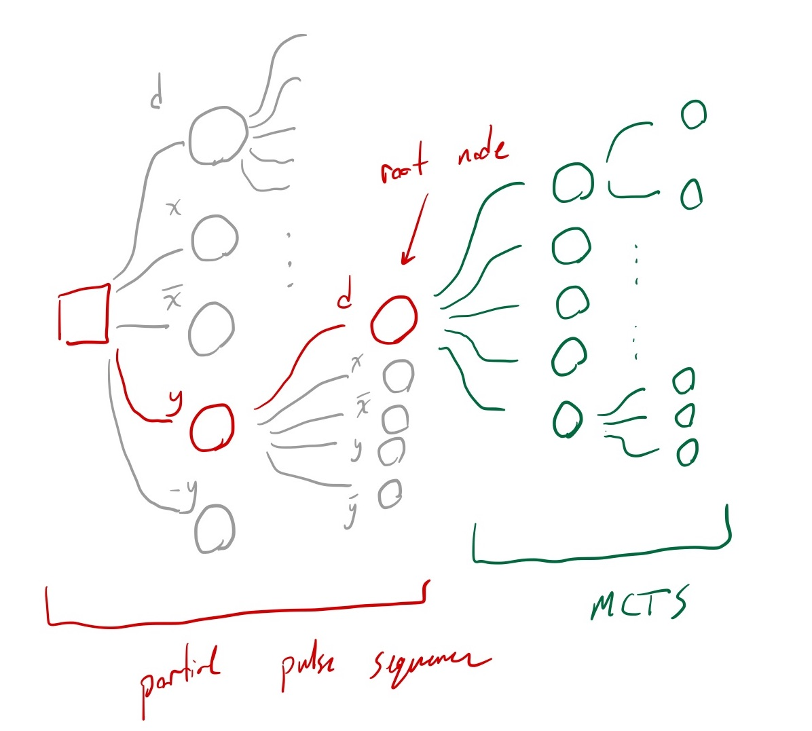
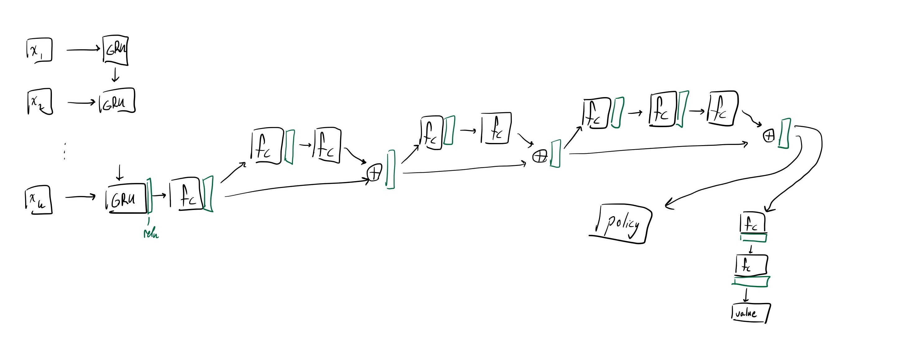

# Quantum control in spin systems

<!--
Include relevant Hamiltonians, q control framework
 -->

$$
H(t) = H_\text{system} + H_\text{control}(t)
$$

$$
H_\text{system} = \sum_i \delta_i I_z^i + \sum_{i,j} d_{ij} \left( 3I_z^iI_z^j - \mathbf{I^i} \cdot \mathbf{I^j} \right)
  = H_\text{CS} + H_\text{D}
$$

$$
  H_\text{control}(t) = -B_1(t) \sum_i \gamma_n^i I_x^i
$$

- Time suspension (protecting coherent states)
- Sensing
- Novel systems

# Existing approaches to quantum control

Average Hamiltonian Theory (AHT) has been used extensively for quantum control

**Include explanation of AHT, or assume prior knowledge?**

Led to WHH-4 from @PhysRevLett.20.180, more recent developments from @O_Keeffe_2019 and @PhysRevLett.119.183603 by applying linear programming techniques

Typically only consider the lowest order term in average Hamiltonian, higher-order terms influence fidelity of pulse sequence

# Reinforcement learning for quantum control

<!--
Agent, environment, state, action, reward
 -->

{width=50%}

- State $\to$ density operator or propagator
- Action $\to$ control Hamiltonian $H_\text{control}(t)$
- Reward $\to$ state or operator fidelity

Can apply RL to discrete control problem (constructing pulse sequences) or continuous control (shaped pulses, continuously-varying control Hamiltonians)

# Constructing pulse sequences using RL

<!--
AlphaZero algorithm, quick summary of what it does
-->

Implemented AlphaZero algorithm from @Silver1140.

{width=45%}

Collects data on pulse sequences, balancing _exploration_ of new pulse sequences and _exploitation_ of learnings (via neural networks), and trains neural networks on collected data to learn from recent experiences.

# Computational results

<!--
Robustness against different sources of error
 -->

Searching for 48-pulse sequence for time suspension ($\overline{H}=0$)

{width=49%}
{width=49%}

**What other time-suspension sequences should I compare with (CORY-48, others)?**

# Experimental results

{decay plots, compare with yxx48 and CORY-48}

<!-- # Future work

...? -->

# Appendix

# Average Hamiltonian Theory (AHT)

The time-evolution operator (or propagator) follows the differential equation
$$
i \frac{d}{dt} U(t) = H(t)U(t)
$$
$$
U(0) = \identity
$$

The Magnus Expansion gives an exponential solution for the propagator via an average Hamiltonian $\overline{H}$ at time $t$
$$
U(t) = \exp\left( -i \overline{H} t \right)
$$
with $\overline{H} = \overline{H}^0 + \overline{H}^1 + \dots$.

The series converges rapidly when $t||H|| \ll 1$, so we often work in the interaction frame of the control Hamiltonian, with transformation operator
$$
i \frac{d}{dt} U_\text{control}(t) = H_\text{control}(t)U_\text{control}(t)
$$
$$
U_\text{control}(0) = \identity
$$
So the Hamiltonian in the interaction frame becomes
$$
\tilde{H}(t) = \tilde{H}_\text{system}(t) = U_\text{control}(t)^\dagger H_\text{system} U_\text{control}(t)
$$

See @brinkmann_2016 for more information.

# AHT: Pulse Sequences

(@PhysRev.175.453)

TODO clarify rf/int and control/system
TODO add density operator, diagrams

If a pulse sequence is both cyclic and periodic (@gerstein-dybowski)
$$
    U_\text{control}(t_c) = T\exp \left(
        -i \int_0^{t_c} H_\text{control}(t) dt \right) = \pm \identity
         \text{(cyclic)}
$$
$$
    H_\text{control}(t) = H_\text{control}(t + Nt_c) \text{(periodic)}
$$

then the interaction frame and the lab frame coincide at multiples of the cycle time, and the propagator can be given by

$$
    U(t_c) = \exp\left( -i t_c (\overline{H}^{(0)} +
        \overline{H}^{(1)} + \dots) \right)
$$
$$
    \overline{H}^{(0)} = 1/t_c \int_0^{t_c}
        \tilde{H}_\text{system}(t) dt
$$
$$
    \overline{H}^{(1)} = 1/2it_c \int_0^{t_c} dt_1 \int_0^t_1 dt_2
        [\tilde{H}_\text{system}(t_1), \tilde{H}_\text{system}(t_2)]
$$

Higher-order terms for average Hamiltonian become increasingly nasty

# AHT: Special Cases

- Symmetric pulse sequences ($H(\tau) = H(t_c - \tau)$): all odd-order terms in average Hamiltonian are zero
- Antisymmetric pulse sequences ($H(\tau) = - H(t_c - \tau)$): all terms in average Hamiltonian are zero

# AHT: WHH-4 Example

# Neural network structure

{width=100%}

# AlphaZero algorithm

- Explore new pulse sequences
  1. Start with a zero-length pulse sequence as the root node
  2. With the given root node, perform Monte Carlo Tree Search (MCTS) to explore potential pulses
    - MCTS uses a neural network to estimate the prior probabilities for selecting each pulse and the value (fidelity) for the final pulse sequence
  3. Sample the next pulse from the root node's children weighted by their visit counts
  4. Repeat steps 2-4 until a complete pulse sequence is determined
  5. Record the child nodes' visit counts and final pulse sequence fidelity to a data buffer for training
- Train neural networks on collected data
  - Policy loss: want to minimize the difference between MCTS visit counts $\mathbf{p}$ and learned policy $\pi_\theta$
  - Value loss: want to minimize the difference between calculated fidelity from pulse sequence $z$ and predicted fidelity from neural network $v$
  - L2 regularization: prevent overfitting to data
  - $l(\theta) = -\mathbf{p} \cdot \log\pi_\theta + (z - v)^2 + c||\theta||^2$

Parameters for MCTS, training, etc.

# Neural network training

{width=49%}
{width=49%}

# Training performance

{width=100%}

# References
